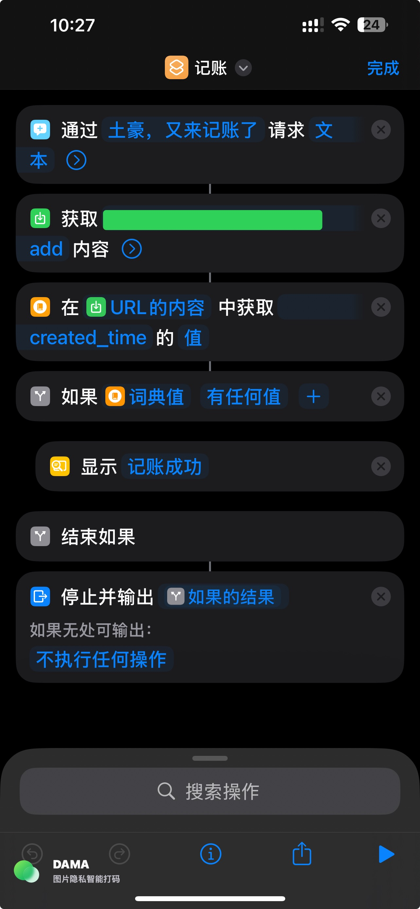

# 记账小助手

基于 Cloudflare Workers + Notion + Scriptable 的个人记账系统，支持 AI 消费分析。

## 功能特点

- **语音记账**：通过 Siri 快捷指令语音输入，AI 自动解析分类
- **实时统计**：iOS 桌面小组件实时显示月度消费数据
- **AI 消费建议**：基于具体消费项目智能分析异常支出，给出个性化建议
- **零成本**：使用 Cloudflare Workers 免费额度，无需服务器
- **数据安全**：数据存储在你自己的 Notion 数据库中

## 架构

```
┌─────────────────┐                    ┌─────────────────┐
│  iOS 快捷指令    │ ── POST /add ───→ │                 │
│  (Siri 记账)    │                    │   Cloudflare    │
└─────────────────┘                    │     Worker      │──→ Notion
                                       │                 │
┌─────────────────┐                    │  - /add 记账    │
│   Scriptable    │ ── GET /stats ──→ │  - /stats 统计  │
│   (小组件展示)   │ ←── JSON 数据 ─── │                 │
└─────────────────┘                    └─────────────────┘
```

## 消费类目

系统支持以下消费类目，AI 会自动识别并分类：

| 类目 | 示例 |
|------|------|
| 餐饮 | 早餐、午餐、晚餐、外卖、奶茶、咖啡 |
| 交通 | 地铁、公交、打车、加油、停车 |
| 购物 | 衣服、鞋、包、电子产品、家电 |
| 日用 | 纸巾、洗护用品、清洁用品 |
| 娱乐 | 电影、游戏、KTV、旅游、门票 |
| 医疗 | 看病、药品、体检 |
| 居住 | 房租、水电、物业、维修 |
| 通讯 | 话费、网费、会员订阅 |
| 社交 | 礼物、红包、请客 |
| 学习 | 书籍、课程、培训 |
| 其他 | 无法归类的消费 |

## 使用方法

### 1. 创建 Notion 数据库

在 Notion 中创建一个数据库，包含以下属性：

| 属性名 | 类型 |
|--------|------|
| 内容 | Title |
| 类目 | Select |
| 价格 | Number |
| 时间 | Date |

### 2. 获取 Notion API Key

1. 访问 [Notion Integrations](https://www.notion.so/my-integrations)
2. 创建一个新的 Integration
3. 复制 API Key
4. 在 Notion 数据库页面，点击右上角 `...` → `Add connections` → 选择你的 Integration

### 3. 部署 Cloudflare Worker

1. 登录 [Cloudflare Dashboard](https://dash.cloudflare.com/)
2. 进入 Workers & Pages → 创建 Worker
3. 将 `notion-worker.js` 的内容粘贴进去
4. 设置环境变量：

| 变量名 | 说明 |
|--------|------|
| `NOTION_API_KEY` | Notion API Key |
| `NotionDatabaseId` | Notion 数据库 ID（URL 中 `?v=` 前面那段） |
| `API_SECRET` | 自定义密钥，用于保护所有接口 |

5. 添加 AI Binding：Settings → Bindings → Add → Workers AI → 名称填 `AI`
6. 部署

### 4. 配置 iOS 快捷指令

创建一个快捷指令，发送 POST 请求到你的 Worker。参考示例：



配置说明：

```
URL: https://你的worker.workers.dev/add?key=你的API_SECRET
Method: POST
Headers: Content-Type: application/json
Body: {"user_input": "快捷指令输入的文本"}
```

或者使用 Header 传递密钥：

```
URL: https://你的worker.workers.dev/add
Method: POST
Headers:
  Content-Type: application/json
  X-API-Key: 你的API_SECRET
Body: {"user_input": "快捷指令输入的文本"}
```

### 5. 配置 Scriptable 小组件

1. 在 iOS 上安装 [Scriptable](https://apps.apple.com/app/scriptable/id1405459188)
2. 创建新脚本，粘贴 `scriptable_minimal.js` 的内容
3. 修改顶部配置：

```javascript
const CONFIG = {
  WORKER_URL: "https://your-worker.workers.dev/stats",
  API_KEY: "your-api-secret-key",
  BUDGET: 4000,  // 月度预算（元）

  // 可选：配置 AI 消费建议
  AI_API_URL: "http://192.168.1.100:3001/v1/chat/completions",  // 你的 AI API 地址
  AI_API_KEY: "your-ai-api-key",  // 你的 AI API Key
  AI_MODEL: "gpt-3.5-turbo"  // 推荐：gpt-3.5-turbo, gpt-4, deepseek-chat
}
```

4. 添加 Scriptable 小组件到桌面（中型尺寸）

### 6. (可选) 配置 AI 消费建议

AI 消费建议功能可以分析你的具体消费项目（如"火锅吃了3次"），给出个性化建议。

**支持的 AI 服务：**
- OpenAI (GPT-3.5, GPT-4)
- 本地部署的 OpenAI 兼容 API
- Gemini、DeepSeek 等其他兼容服务
- 支持 HTTP/HTTPS（适配内网部署）

**配置步骤：**
1. 在 `scriptable_minimal.js` 中填写 `AI_API_URL`、`AI_API_KEY`、`AI_MODEL`
2. 如果不配置 AI，小组件仍可正常显示消费统计
3. AI 分析失败不会影响数据展示

## 使用示例

对 Siri 说：

- "记账，午饭 25 元"
- "记账，打车 30"
- "记账，买了一件衣服 299"

AI 会自动识别：
- 消费内容
- 金额
- 类目（自动分类）

## API 接口

**注意：所有接口都需要密钥验证**，通过 URL 参数 `?key=xxx` 或 Header `X-API-Key: xxx` 传递。

### POST /add

记账接口，添加一条消费记录。

**请求：**
```
POST /add?key=你的API_SECRET
Content-Type: application/json

{
  "user_input": "午饭 25元"
}
```

**响应：**
```json
{
  "id": "page-id",
  "properties": { ... }
}
```

### GET /stats

统计接口，获取本月消费统计。

**请求：**
```
GET /stats?key=你的API_SECRET
```

**响应：**
```json
{
  "totalPrice": 1234.56,
  "expensiveCount": 2,
  "foodAmount": 500.00,
  "nonFoodAmount": 734.56,
  "categories": [
    { "name": "餐饮", "amount": 500.00 },
    { "name": "交通", "amount": 234.56 },
    { "name": "购物", "amount": 500.00 }
  ],
  "items": [
    { "title": "午餐", "price": 45.00, "category": "餐饮" },
    { "title": "打车", "price": 30.00, "category": "交通" },
    ...
  ]
}
```

**说明：**
- `categories` - 按类目统计的消费金额（降序排列）
- `items` - 具体消费项目列表（前20笔最大消费，用于 AI 分析）

## 技术栈

- **Cloudflare Workers** - Serverless 运行环境
- **Cloudflare Workers AI** - AI 解析用户输入（Llama 3.1 8B）
- **Notion API** - 数据存储
- **Scriptable** - iOS 小组件

## 许可证

MIT
